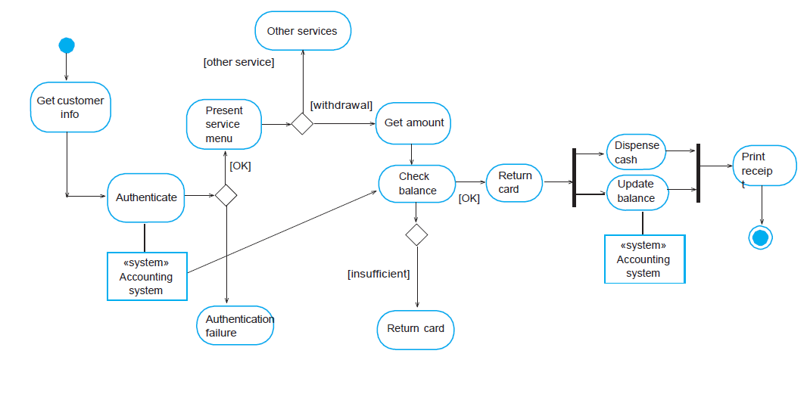

# Lab 11.4 Behavioural Modelling

1. Read the two sub sections 11.1 and 11.2 UML Activity and State Machine Diagrams.  Using select a textual design tool using [www.kroki.io](www.kroki.io), draw the activity and state diagrams from these two documents provided. 

2. Based on your experience with a bank ATM, draw an activity diagram that models the data processing involved when a customer withdraws cash from the machine. 

    

    
Possible Solution

    

    

3. In your groups, start thinking and developing activity and state diagrams for the assignment.