# Lab 12 Creating a Microsoft Access Database

You will be: 

• Making a database in Microsoft Access.

• Connecting to a database in Visual Studio.

• Adding a value to the database using Visual Studio. 

---

## Step 1

Start by opening a blank new database in Access.

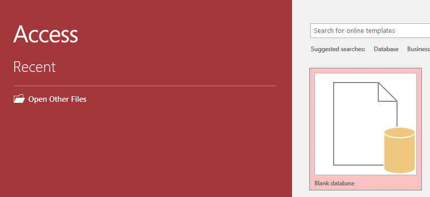
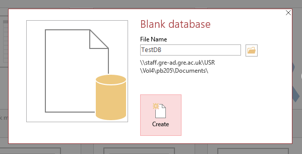

Make sure you call the database exactly: “TestDB”! Otherwise it will result in a typo when it comes to connecting your database to your program later! 

## Step 2

There are two views: Design and Datasheet. Design is where you edit the template for the data. Datasheet (or “Table”) view is where you can add new items to the database. Click Design View.

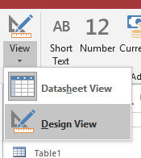

It will prompt you to name and save your first table. Since we’re starting with the food that goes on the shelves, it makes sense to start by creating a template for “items” as in “food items”.

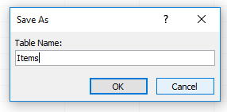

Tables are groups of “things”. There can be many versions of similar “things”. This is similar to classes and structs in programming languages: You can have many different versions of a “thing” that fit one template (also known as an object structure or data schema). 

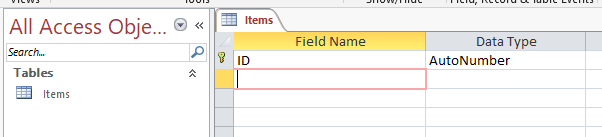

> **Note:** If you do your design well, you should know what your tables should look like before you even make them!!

These are your “fields”. Each “object” in your database will have a value for all of these fields. If an object needs a value that doesn’t fit in one of these fields, you can come back to this screen to add a new field. For example, you may want to add which side of the aisle the item is on (Left or Right).

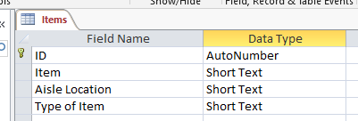

Return to datasheet view. It will prompt you to save your database.

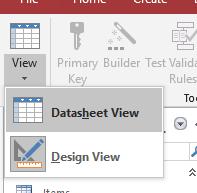

## Step 3

Experiment with adding some items to your database. You’ll notice that ID will increase every time you add a new item. You also might wonder what happens if you put a letter in the Aisle Location field, it will let you, but this might get confusing as aisles are normally just numbered (integers).

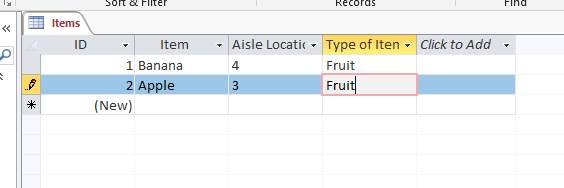

To fix this, go back to design view.

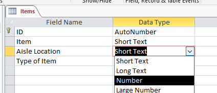

If you click the drop down next to the field name, you can select from a few rules about the type of data that field should expect. If you choose “number” for the Aisle Location, you will only be able to input numbers when you add new entries.

> **Note:** 
>> **Primary Keys**
>>
>> The database keeps track of every new entry. To ensure each new entry is unique and can be tracked, it is assigned what is known as a “primary key”. This is a field that is always unique for every entry. Any field can be made into the primary key but, by default, the ID field is created and is assigned the “data type” **AutoNumber**.
>>
>> **AutoNumber** will start at 1 and increase by 1 every time you add a new entry. Even if you add two, three, four entries called “banana”; they will all have different IDs.

The final question you might have is: What if two developers disagree about what a “type of item” is called. Some people consider eggs in the dairy category, some people call it produce, some people group it with meat. All of these people are incorrect. The person who added “eggs” was adding 50 new chocolate products to the database and they were thinking about chocolate Easter Eggs.

**This is why data design is so important! You need to protect the integrity of the data from the people who will use it and access it!**

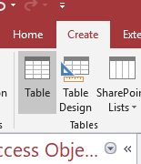

Create a new table and immediately switch to design view.

## Step 4

Create a new table and immediately switch to design view. 

When you switch to design view, save the table name as "Categories".

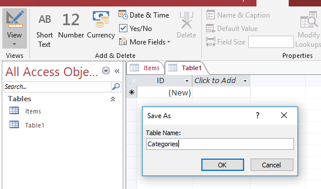

In this new table, add a single field called "Categories". Leave this as a "short text" data type.

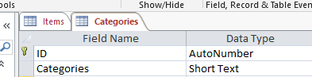

**Save this table and return to Table View. Add a few different item categories to this table.**

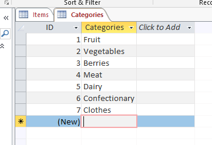

**Save again now and close the "Categories" table.**

## Step 5

 - Return to the **Items** table. 
 
 - In **Datasheet View**, delete any existing records in the **Items** table! (This will cause an error later if you don’t.) 
 
 - Be sure to save again once you’ve deleted the existing records.

In Design View, select the “lookup wizard” under the data type options for “Type of Item”.

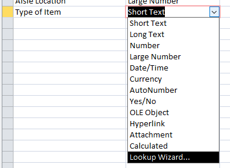

Select the option to ...**lookup fields from another table**... (The top one.)

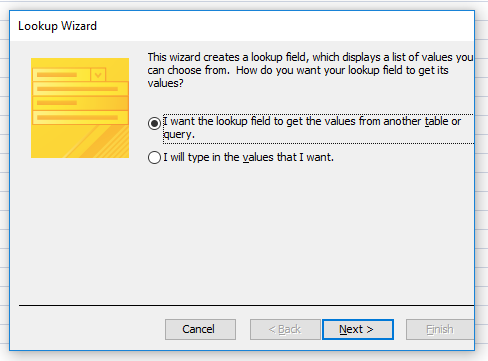

Select the Table: **Categories**.

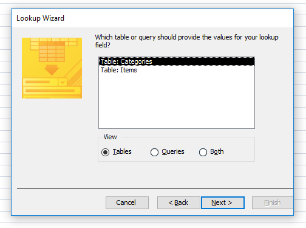

Highlight the **Categories** field and click the single right arrow button. The **Categories** field should now be on the right and only the Categories field. 

<table>
<tr>
<td>

</td>
<td>

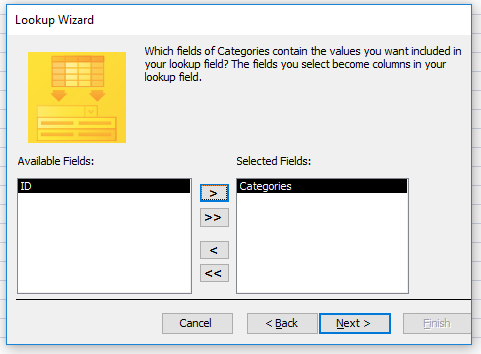
</td>
</tr>
</table>

The next page just lets you choose how to sort the data. It doesn’t matter but I sort by **Categories** in alphabetical (A to Z). The button to the left lets you switch to alphabetical **ascending** (Z to A).

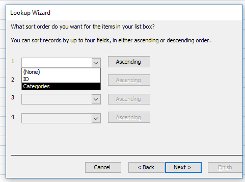

It should look like this. Make sure the **Hide key column** box is ticked. Press next.

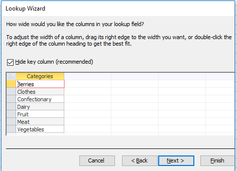

It should look like this. Make sure the “Hide key column” box is ticked. Press next.

Finally, tick the **Enable Data Integrity** box and choose **Restrict Delete**. This means that if you have an item in the **Items** table that relies on a **Category** from the **Categories** table, it won’t be able to be deleted later.  It’ll prompt you to save when you press Finish. If an error pops up, you may not have deleted the existing entries in **Items**.

It will prompt you to name and save your first table. Since we’re starting with the food that goes on the shelves, it makes sense to start by creating a template for **items** as in **food items**.

> **Note:**
>
>> **Data integrity**
>>
>> Is an important phrase: As you’ve already seen, it can be quite disastrous when the system doesn’t use consistent data. This becomes especially true when you start sharing the same bits of data between different tables; and even more so when you share data with applications.

## Stage 6

Change back to Datasheet/Table view and you can now add new items and pick the **Type of Item** from a drop down box. 

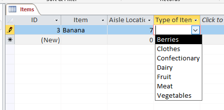

>**Note:**
>
>>Remember this very important lesson: Users makes mistakes. The less input you give them the less chance they can break something

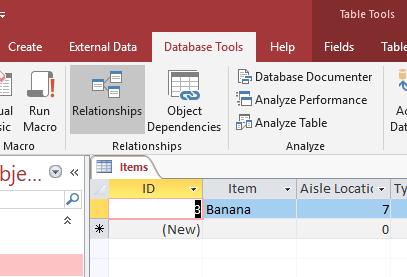

Under the **Database Tools** ribbon, you will find a button for **Relationships**. Clicking on this will show you the connections between your tables.

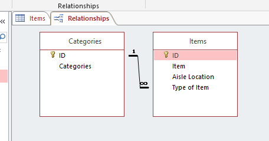

Look familiar? There’s a reason your design diagrams look the way they do. It translates directly into implementation, making it very easy to check everything is right.