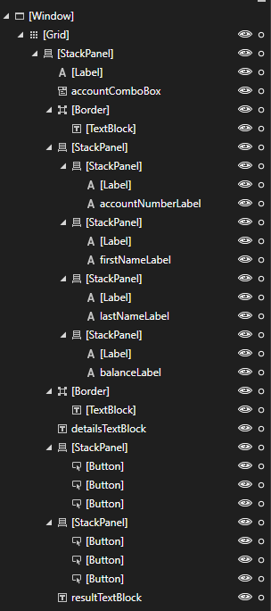
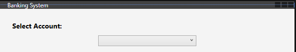
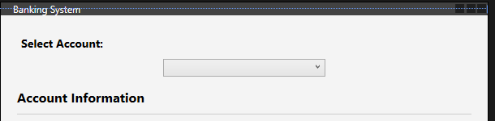
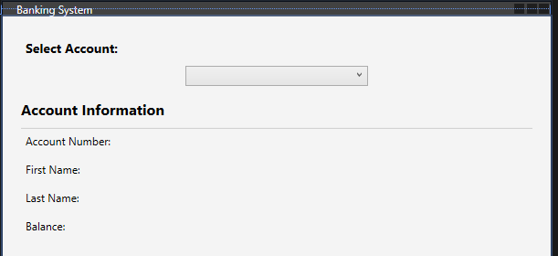
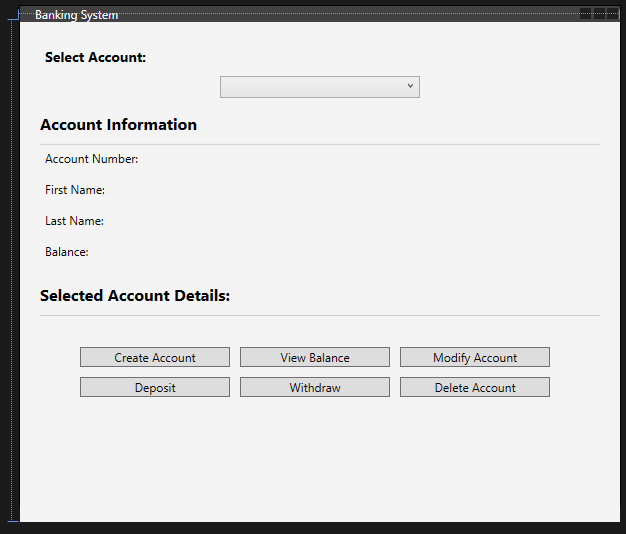
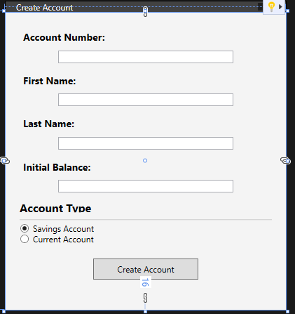
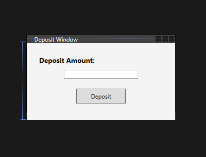
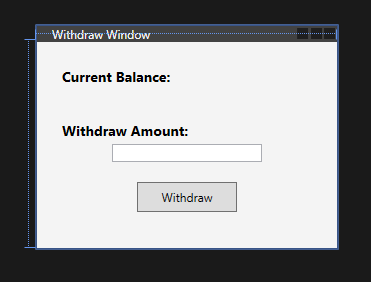
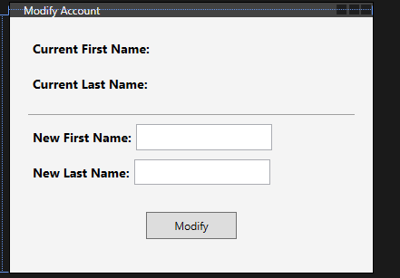

# Lab 14: OOP using a GUI

We are going to create a new C# Windows Platform Application give it the project name `BankingApp_Wpf`.


## 1: Modifying MainWindow.xaml
1. The following MainWindow layout will be implemented: 

<div align=center>



</div>

2. Firstly you need modify the `<Window ..>` tag so that the Title attribute says Banking System,  and the height and width are 500 and 600. 

    ```xml
    <Window x:Class="BankingApp_Wpf.MainWindow"
            xmlns="http://schemas.microsoft.com/winfx/2006/xaml/presentation"
            xmlns:x="http://schemas.microsoft.com/winfx/2006/xaml"
            Title="Banking System" Height="500" Width="600">
    ```

3. Next modify the Grid tag like the following so that you have a new background colour:

    ```xml
    <Grid Background="#F4F4F4" Margin="0,0,0,-16">
    ```

4. The Banking App will have dropdown box that will allow the user to select from a list of accounts. Using a `StackPanel`, which arranges child elements into a single line that can be oriented horizontally or vertically, add a Label and ComboBox like so:

    ```xml
    <Grid Background="#F4F4F4" Margin="0,0,0,-16">
        <StackPanel Margin="20,20,20,7">
            <Label Content="Select Account:" FontWeight="Bold" FontSize="14"/>
            <ComboBox x:Name="accountComboBox" Width="200" Margin="0,5,0,15" SelectionChanged="AccountComboBox_SelectionChanged"/>
    ```
    <div align=center>

    

    </div>

5. Following on from this we will need to create a separation using a border for the next section of this form, which will be the account information.

    ```xml
    <Border BorderBrush="#CCCCCC" BorderThickness="0,0,0,1" Padding="0,0,0,10">
                    <TextBlock Text="Account Information" FontWeight="Bold" FontSize="16"/>
                </Border>
    ```

    <div align=center>

    

    <div>

6. Now we need to create a new `StackPanel` to house our **Account Number**, **First** \& **Last name**, and **account balanace**:

    ```xml
    <StackPanel Margin="0,0,0,15">
        <StackPanel Orientation="Horizontal" Margin="0,0,0,5">
            <Label Content="Account Number:"/>
            <Label x:Name="accountNumberLabel" Width="200" Margin="10,0,0,0"/>
        </StackPanel>
        <StackPanel Orientation="Horizontal" Margin="0,0,0,5">
            <Label Content="First Name:"/>
            <Label x:Name="firstNameLabel" Width="200" Margin="10,0,0,0"/>
        </StackPanel>
        <StackPanel Orientation="Horizontal" Margin="0,0,0,5">
            <Label Content="Last Name:"/>
            <Label x:Name="lastNameLabel" Width="200" Margin="10,0,0,0"/>
        </StackPanel>
        <StackPanel Orientation="Horizontal" Margin="0,0,0,5">
            <Label Content="Balance:"/>
            <Label x:Name="balanceLabel" Width="200" Margin="10,0,0,0"/>
        </StackPanel>
    </StackPanel>
    ```

    <div align=center>

    

    <div>

7. Penultimately, some control buttons need to be added so the user can interact with accounts:

    ```xml
    <Border BorderBrush="#CCCCCC" BorderThickness="0,0,0,1" Padding="0,0,0,10">
                    <TextBlock Text="Selected Account Details:" FontWeight="Bold" FontSize="16"/>
                </Border>

                <StackPanel Orientation="Horizontal" HorizontalAlignment="Center">
                    <Button Content="Create Account" Width="150" Click="CreateAccountButton_Click" Margin="0,0,10,0"/>
                    <Button Content="View Balance" Width="150" Click="ViewBalanceButton_Click" Margin="0,0,10,0"/>
                    <Button Content="Modify Account" Width="150" Click="ModifyAccountButton_Click" Margin="0,0,10,0"/>
                </StackPanel>

                <StackPanel Orientation="Horizontal" HorizontalAlignment="Center" Margin="0,10,0,0">
                    <Button Content="Deposit" Width="150" Click="DepositButton_Click" Margin="0,0,10,0"/>
                    <Button Content="Withdraw" Width="150" Click="WithdrawButton_Click" Margin="0,0,10,0"/>
                    <Button Content="Delete Account" Width="150" Click="DeleteAccountButton_Click" Margin="0,0,10,0"/>
                </StackPanel>        
    ```
**Output:**

<div align=center>



</div>

8. Lastly, add a `TextBlock` for verbose feedback to the user:

    ```xml
    <TextBlock x:Name="resultTextBlock" TextWrapping="Wrap" Height="34" RenderTransformOrigin="0.5,0.5" Width="548">
                </TextBlock>
            </StackPanel>
        </Grid>
    </Window>
    ```

<details>
<summary>Show Full Code...</summary>

```xml
<Window x:Class="BankingApp_Wpf.MainWindow"
        xmlns="http://schemas.microsoft.com/winfx/2006/xaml/presentation"
        xmlns:x="http://schemas.microsoft.com/winfx/2006/xaml"
        Title="Banking System" Height="500" Width="600">
    <Grid Background="#F4F4F4" Margin="0,0,0,-16">
        <StackPanel Margin="20,20,20,7">
            <Label Content="Select Account:" FontWeight="Bold" FontSize="14"/>
            <ComboBox x:Name="accountComboBox" Width="200" Margin="0,5,0,15" SelectionChanged="AccountComboBox_SelectionChanged"/>

            <Border BorderBrush="#CCCCCC" BorderThickness="0,0,0,1" Padding="0,0,0,10">
                <TextBlock Text="Account Information" FontWeight="Bold" FontSize="16"/>
            </Border>

            <StackPanel Margin="0,0,0,15">
                <StackPanel Orientation="Horizontal" Margin="0,0,0,5">
                    <Label Content="Account Number:"/>
                    <Label x:Name="accountNumberLabel" Width="200" Margin="10,0,0,0"/>
                </StackPanel>
                <StackPanel Orientation="Horizontal" Margin="0,0,0,5">
                    <Label Content="First Name:"/>
                    <Label x:Name="firstNameLabel" Width="200" Margin="10,0,0,0"/>
                </StackPanel>
                <StackPanel Orientation="Horizontal" Margin="0,0,0,5">
                    <Label Content="Last Name:"/>
                    <Label x:Name="lastNameLabel" Width="200" Margin="10,0,0,0"/>
                </StackPanel>
                <StackPanel Orientation="Horizontal" Margin="0,0,0,5">
                    <Label Content="Balance:"/>
                    <Label x:Name="balanceLabel" Width="200" Margin="10,0,0,0"/>
                </StackPanel>
            </StackPanel>

            <Border BorderBrush="#CCCCCC" BorderThickness="0,0,0,1" Padding="0,0,0,10">
                <TextBlock Text="Selected Account Details:" FontWeight="Bold" FontSize="16"/>
            </Border>

            <StackPanel Orientation="Horizontal" HorizontalAlignment="Center">
                <Button Content="Create Account" Width="150" Click="CreateAccountButton_Click" Margin="0,0,10,0"/>
                <Button Content="View Balance" Width="150" Click="ViewBalanceButton_Click" Margin="0,0,10,0"/>
                <Button Content="Modify Account" Width="150" Click="ModifyAccountButton_Click" Margin="0,0,10,0"/>
            </StackPanel>

            <StackPanel Orientation="Horizontal" HorizontalAlignment="Center" Margin="0,10,0,0">
                <Button Content="Deposit" Width="150" Click="DepositButton_Click" Margin="0,0,10,0"/>
                <Button Content="Withdraw" Width="150" Click="WithdrawButton_Click" Margin="0,0,10,0"/>
                <Button Content="Delete Account" Width="150" Click="DeleteAccountButton_Click" Margin="0,0,10,0"/>
            </StackPanel>
            <TextBlock x:Name="resultTextBlock" TextWrapping="Wrap" Height="34" RenderTransformOrigin="0.5,0.5" Width="548">
            </TextBlock>
        </StackPanel>
    </Grid>
</Window>
```
</details>

>**Note:**
>>We will revist the `MainWindow.xaml.cs` later as we need to setup a **base** class and **derived** classes

## n: Creating the Account `abstract` class:

An `abstract` class is a class in object-oriented programming that cannot be instantiated on its own and is meant to be **subclassed** by other classes. It often contains abstract methods, which are methods without a body, intended to be implemented by the subclasses. Abstract classes can also have regular methods with an implementation.

9. Add a new `Windows Presentation Foundation window` by doing the following:


10. In the code below, the `Account` class is declared as an `abstract` class. Reproduce: 

    <details>
    <summary>Show Code:</summary>

    ```csharp
    /// <summary>
    /// Represents an abstract class for various types of accounts in a banking system.
    /// </summary>
    public abstract class Account
    {
        /// <summary>
        /// Gets or sets the account number.
        /// </summary>
        public int AccountNumber { get; set; }

        /// <summary>
        /// Gets or sets the first name of the account holder.
        /// </summary>
        public string FirstName { get; set; }

        /// <summary>
        /// Gets or sets the last name of the account holder.
        /// </summary>
        public string LastName { get; set; }

        /// <summary>
        /// Gets or sets the balance of the account.
        /// </summary>
        protected double Balance { get; set; }

        /// <summary>
        /// Creates a new account with the specified details.
        /// </summary>
        /// <param name="accountNumber">The account number.</param>
        /// <param name="firstName">The first name of the account holder.</param>
        /// <param name="lastName">The last name of the account holder.</param>
        public Account(int accountNumber, string firstName, string lastName)
        {
            AccountNumber = accountNumber;
            FirstName = firstName;
            LastName = lastName;
            Balance = 0;
        }

        /// <summary>
        /// Deposits the specified amount into the account.
        /// </summary>
        /// <param name="amount">The amount to be deposited.</param>
        public abstract void Deposit(double amount);

        /// <summary>
        /// Withdraws the specified amount from the account.
        /// </summary>
        /// <param name="amount">The amount to be withdrawn.</param>
        public abstract void Withdraw(double amount);

        /// <summary>
        /// Displays the current balance of the account.
        /// </summary>
        public abstract void DisplayBalance();

        /// <summary>
        /// Modifies the account details.
        /// </summary>
        /// <param name="firstName">The new first name of the account holder.</param>
        /// <param name="lastName">The new last name of the account holder.</param>
        public void ModifyAccount(string firstName, string lastName)
        {
            FirstName = firstName;
            LastName = lastName;
        }

        /// <summary>
        /// Deletes the account.
        /// </summary>
        public void DeleteAccount()
        {
            // Additional logic for account deletion, if needed
            Console.WriteLine($"Account {AccountNumber} deleted.");
        }
    }
    ```

    </details>

- Let's break down its key aspects,:
    - `Deposit`, `Withdraw`, and `DisplayBalance` are abstract methods.

    - They are declared in the abstract class but lack an implementation (i.e., no method body). Subclasses (like `SavingsAccount` and `CurrentAccount`) must provide concrete implementations for these methods.   

    - The `<summary>` tags provide a brief description of the purpose of the class and each method.

    - The `<param>` tags describe the parameters of each method, specifying what each parameter represents.

- These comments follow the XML documentation format, which is commonly used in C# to provide inline documentation. This format supports tools like IntelliSense to display information about classes and methods as developers use them.

    >**Summary:**
    >> The concept of abstraction is highlighted by the fact that the Account class provides a high-level interface for various types of accounts without specifying the exact details of how depositing, withdrawing, or displaying balance is done. The details are left to the subclasses to define.

## 2: Creating the `SavingsAccount` and `CurrentAccount`  through inheritance of Account class `abstract` class:

11. You now need to add two new classes one called, `SavingsAccount` and the other `CurrentAccount`, like you did before

- The `SavingsAccount` and `CurrentAccount` classes **inherit** from the `Account` class. By doing so, they are obligated to implement the abstract methods defined in the `Account` class:

 - `Deposit()`
 - `Withdraw()`
 - `DisplayBalance()`

12. Open the `SavingsAccounts.cs` file and reproduce the following:

    <details>
    <summary>Code here:</summary>
    
    ```csharp
     public class SavingsAccount : Account
    {
        // Constructor
        public SavingsAccount(int accountNumber, string firstName, string lastName, double balance)
            : base(accountNumber, firstName, lastName){
        }

        // Implement abstract methods
        public override void Deposit(double amount)
        {
            // Implement deposit logic
            Balance += amount;
        }

        public override void Withdraw(double amount)
        {
            // Implement withdrawal logic
            if (Balance >= amount)
            {
                Balance -= amount;
            }
            else
            {
                Console.WriteLine("Insufficient funds for withdrawal.");
            }
        }

        public override double GetBalance()
        {
            return Balance;
        }
    }
    ```
    
    </details>

13. Open the `CurrentAccounts.cs` file and reproduce the following:

    <details>
    <summary>Code here:</summary>
    
    ```csharp
    public class CurrentAccount : Account
    {
        // Constructor
        public CurrentAccount(int accountNumber, string firstName, string lastName, double balance)
            : base(accountNumber, firstName, lastName){
        }

        // Implement abstract methods
        public override void Deposit(double amount)
        {
            // Implement deposit logic for current account
            Balance += amount;
        }

        public override void Withdraw(double amount)
        {
            // Implement withdrawal logic for current account
            if (Balance >= amount)
            {
                Balance -= amount;
            }
            else
            {
                Console.WriteLine("Insufficient funds for withdrawal.");
            }
        }

        public override double GetBalance()
        {
            return Balance;
        }
    }
    ```

    </details>

- Code that uses the `Account` class can work with any **derived** class (e.g., `SavingsAccount` or `CurrentAccount`) without knowing the specific details of each account type. This is an example of **polymorphism**, where different types of objects (subclasses) can be treated as instances of the base class.

- The **properties** `AccountNumber`, `FirstName`, and `LastName` are directly accessible in these **derived** classes, allowing you to use the account information in the implementation.

>**Summary:**
>> - **Abstract** classes can define a contract that their subclasses must follow. In this case, any class representing an account must implement the methods specified in the `Account` class.
>>
>> - By using an abstract class, you provide a common structure and interface for different types of accounts, allowing for code reusability and making it easier to extend the system with new account types in the future.
>>
>> - Now, when you create instances of `SavingsAccount` or `CurrentAccount`, you can set and retrieve the account details through the properties inherited from the `Account` base class.

## 3: Creating the `CreateAccount`, `ModifyWindow`, `DepositWindow`, and `WithdrawWindow` classes:

14. You need to create the following `Windows Presentation Foundation window`, this generates two files the `filename.xaml` and a child file `filename.xaml.cs`:

- Make the following `CreateAccount`, `ModifyWindow`, `DepositWindow`, and `WithdrawWindow`


15. Once that is done, modify the `CreateAccount.xaml`. 

 - Using the elements `Grid`, `StackPanel`, `Label`, `Texbox`, `Button` the following will be created:
    - Account Number
    - FirstName
    - Last Name
    - Initial Balance
    - Account Type Radio buttons:
        - Saving Account
        - Current Account
    - A submit button
    <details>
    <summary>Code here...</summary>

    ```xml
    <Window x:Class="BankingApp_Wpf.CreateAccount"
            xmlns="http://schemas.microsoft.com/winfx/2006/xaml/presentation"
            xmlns:x="http://schemas.microsoft.com/winfx/2006/xaml"
            Title="Create Account" Height="423" Width="400">
        <Grid Background="#F4F4F4" Margin="0,0,0,-16">
            <StackPanel Margin="20">
                <Label Content="Account Number:" FontWeight="Bold" FontSize="14"/>
                <TextBox x:Name="accountNumberTextBox" Width="250" Margin="0,5,0,10"/>

                <Label Content="First Name:" FontWeight="Bold" FontSize="14"/>
                <TextBox x:Name="firstNameTextBox" Width="250" Margin="0,5,0,10"/>

                <Label Content="Last Name:" FontWeight="Bold" FontSize="14"/>
                <TextBox x:Name="lastNameTextBox" Width="250" Margin="0,5,0,10"/>

                <Label Content="Initial Balance:" FontWeight="Bold" FontSize="14"/>
                <TextBox x:Name="initialBalanceTextBox" Width="250" Margin="0,5,0,10"/>

                <Border BorderBrush="#CCCCCC" BorderThickness="0,0,0,1" Padding="0,0,0,10" Height="29">
                    <TextBlock Text="Account Type" FontWeight="Bold" FontSize="16"/>
                </Border>

                <StackPanel Margin="0,5,0,10">
                    <RadioButton x:Name="savingsRadioButton" Content="Savings Account" IsChecked="True"/>
                    <RadioButton x:Name="currentRadioButton" Content="Current Account"/>
                </StackPanel>

                <Button Content="Create Account" Width="150" Height="30" Click="CreateAccountButton_Click" Margin="0,10,0,0"/>
            </StackPanel>
        </Grid>
    </Window>
    ```
    
    </details>

    <div align=center>

    

    </div>

16. Once that is done, you can wirte the C# program for `CreateAccount.xaml.cs`. 
    
    <details>
    <summary>Code here...</summary>
    
    ```csharp
    /// <summary>
    /// Interaction logic for CreateAccount.xaml
    /// </summary>
    public partial class CreateAccount : Window
    {
        public List<int> AccountNumbers { get; set; }
        public bool IsSavingsAccount { get; private set; }

        public CreateAccount()
        {
            InitializeComponent();
        }

        private void CreateAccountButton_Click(object sender, RoutedEventArgs e)
        {
            int newAccountNumber;
            if (!int.TryParse(accountNumberTextBox.Text, out newAccountNumber))
            {
                MessageBox.Show("Invalid account number. Please enter a valid integer.");
                return;
            }

            if (AccountNumbers.Contains(newAccountNumber))
            {
                MessageBox.Show("Account number already exists. Please choose a different account number.");
                return;
            }

            // Set IsSavingsAccount based on radio button selection
            IsSavingsAccount = savingsRadioButton.IsChecked ?? false;

            DialogResult = true; // Set DialogResult to true to indicate successful account creation
            Close();
        }
    }
    ```

    </details>

17. Once that is done, modify the `DepositWindow.xaml`. 

 - Using the elements `Grid`, `StackPanel`, `Label`, `Texbox`, `Button` the following will be created:
    - Deposit Title
    - Input box
    - A submit button
    <details>
    <summary>Code here...</summary>

    ```xml
    <Window x:Class="BankingApp_Wpf.DepositWindow"
            xmlns="http://schemas.microsoft.com/winfx/2006/xaml/presentation"
            xmlns:x="http://schemas.microsoft.com/winfx/2006/xaml"
            Title="Deposit Window" Height="155" Width="300">
        <Grid Background="#F4F4F4" Margin="0,0,0,-16">
            <StackPanel Margin="20">
                <Label Content="Deposit Amount:" FontWeight="Bold" FontSize="14"/>
                <TextBox x:Name="depositAmountTextBox" Width="150" Margin="0,5,0,10"/>

                <Button Content="Deposit" Width="100" Height="30" Click="DepositButton_Click" Margin="0,10,0,0"/>
            </StackPanel>
        </Grid>
    </Window>
    ```

    </details>

    <div align=center>

    

    </div>

18. Once that is done, you can wirte the C# program for `DepositWindow.xaml.cs`.

    <details>
    <summary>Code here...</summary>

    ```csharp
    public partial class DepositWindow : Window
    {
        public double DepositAmount { get; private set; }

        public DepositWindow()
        {
            InitializeComponent();

            
        }

        private void DepositButton_Click(object sender, RoutedEventArgs e)
        {
            if (double.TryParse(depositAmountTextBox.Text, out double amount))
            {
                DepositAmount = amount;
                DialogResult = true; // Set DialogResult to true to indicate successful deposit
                Close();
            }
            else
            {
                MessageBox.Show("Invalid amount. Please enter a valid number.");
            }
        }
    }
    ```

    </details>

19. Once that is done, modify the `WithdrawWindow.xaml`.   

 - Using the elements `Grid`, `StackPanel`, `Label`, `Texbox`, `Button` the following will be created:
    - Current Balance Label 
    - Balance Labe
    - Withdraw Amount Label and Input box
    - A submit button
    
    <details>
    <summary>Code here...</summary>

    ```xml
    <Window x:Class="BankingApp_Wpf.WithdrawWindow"
            xmlns="http://schemas.microsoft.com/winfx/2006/xaml/presentation"
            xmlns:x="http://schemas.microsoft.com/winfx/2006/xaml"
            Title="Withdraw Window" Height="222" Width="300">
        <Grid Background="#F4F4F4">
            <StackPanel Margin="20">
                <Label Content="Current Balance:" FontWeight="Bold" FontSize="14"/>
                <Label x:Name="currentBalanceLabel" Width="150" Margin="0,5,0,10"/>

                <Label Content="Withdraw Amount:" FontWeight="Bold" FontSize="14"/>
                <TextBox x:Name="withdrawAmountTextBox" Width="150" Margin="0,0,0,10"/>

                <Button Content="Withdraw" Width="100" Height="30" Click="WithdrawButton_Click" Margin="0,10,0,0"/>
            </StackPanel>
        </Grid>
    </Window>
    ```

    </details>

    <div align=center>

    

    </div>

20. Once that is done, you can wirte the C# program for `WithdrawWindow.cs`.

    <details>
    <summary>Code here...</summary>

    ```csharp
    public partial class WithdrawWindow : Window
    {
        public double WithdrawAmount { get; private set; }

        public WithdrawWindow(double currentBalance)
        {
            InitializeComponent();
            currentBalanceLabel.Content = $"{currentBalance}";
        
        }

        private void WithdrawButton_Click(object sender, RoutedEventArgs e)
        {
            if (double.TryParse(withdrawAmountTextBox.Text, out double amount))
            {
                WithdrawAmount = amount;
                DialogResult = true; // Set DialogResult to true to indicate successful withdrawal
                Close();
            }
            else
            {
                MessageBox.Show("Invalid amount. Please enter a valid number.");
            }
        }
    }
    ```

    </details>

21. Once that is done, modify the `ModifyWindow.xaml`.

- Using the elements `Grid`, `StackPanel`, `Label`, `Texbox`, `Button` the following will be created:
    - Current First and Last Name labels
    - New First and Last Name labels and inputs
    - A submit button

    <details>
    <summary>Code here...</summary>
        
    ```xml
    <Window x:Class="BankingApp_Wpf.ModifyWindow"
            xmlns="http://schemas.microsoft.com/winfx/2006/xaml/presentation"
            xmlns:x="http://schemas.microsoft.com/winfx/2006/xaml"
            Title="Modify Account" Height="298" Width="400">
        <Grid Background="#F4F4F4">
            <StackPanel Margin="20">
                <StackPanel Orientation="Horizontal" Margin="0,0,0,10">
                    <Label Content="Current First Name:" FontWeight="Bold" FontSize="14"/>
                    <Label x:Name="currentFirstNameLabel" Width="150" Margin="0,0,0,0"/>
                </StackPanel>

                <StackPanel Orientation="Horizontal" Margin="0,0,0,10">
                    <Label Content="Current Last Name:" FontWeight="Bold" FontSize="14"/>
                    <Label x:Name="currentLastNameLabel" Width="150" Margin="0,0,0,0"/>
                </StackPanel>

                <Separator Margin="0,10,0,10" HorizontalAlignment="Stretch" VerticalAlignment="Center"/>

                <StackPanel Orientation="Horizontal" Margin="0,0,0,10">
                    <Label Content="New First Name:" FontWeight="Bold" FontSize="14"/>
                    <TextBox x:Name="newFirstNameTextBox" Width="150" Margin="0,0,0,0"/>
                </StackPanel>

                <StackPanel Orientation="Horizontal" Margin="0,0,0,20">
                    <Label Content="New Last Name:" FontWeight="Bold" FontSize="14"/>
                    <TextBox x:Name="newLastNameTextBox" Width="150" Margin="0,0,0,0"/>
                </StackPanel>

                <Button Content="Modify" Width="100" Height="30" Click="ModifyButton_Click" Margin="0,10,0,0"/>
            </StackPanel>
        </Grid>
    </Window>
    ```

    </details>

    <div align=center>

    

    </div>

22. Once that is done, you can wirte the C# program for `ModifyWindow.cs`.

    <details>
    <summary>Code here...</summary>

    ```csharp
    public partial class ModifyWindow : Window
    {
        public string NewFirstName { get; private set; }
        public string NewLastName { get; private set; }

        public ModifyWindow(string fn, string ln)
        {
            InitializeComponent();
            currentFirstNameLabel.Content = fn;
            currentLastNameLabel.Content = ln;
        }

        private void ModifyButton_Click(object sender, RoutedEventArgs e)
        {
            NewFirstName = newFirstNameTextBox.Text;
            NewLastName = newLastNameTextBox.Text;

            if (!string.IsNullOrWhiteSpace(NewFirstName) && !string.IsNullOrWhiteSpace(NewLastName))
            {
                DialogResult = true; // Set DialogResult to true to indicate successful modification
                Close();
            }
            else
            {
                MessageBox.Show("Both First Name and Last Name must be provided.");
            }
        }
    }
    ```
    
    </details>

## 3: Building the `MainWindow.xaml.cs` class:

In this section the functionality of the `MainWindow.xaml.cs` will be implemented. 

Recall the `MainWindow.xaml` file where the implemenation of interactive element such as a `ComboBox` or a `Button`, part of the the tag included the attribute` SelectionChanged` or `Click`:

```xml
...
<ComboBox x:Name="accountComboBox" Width="200" Margin="0,5,0,15" SelectionChanged="AccountComboBox_SelectionChanged"/>
...
<Button Content="Create Account" ... Click="CreateAccountButton_Click" .../>
<Button Content="View Balance" ...  Click="ViewBalanceButton_Click" .../>
<Button Content="Modify Account" ... Click="ModifyAccountButton_Click" .../>
...
<Button Content="Deposit" ... Click="DepositButton_Click" .../>
<Button Content="Withdraw" ... Click="WithdrawButton_Click" .../>
<Button Content="Delete Account" ... Click="DeleteAccountButton_Click" .../>
...
```


23. We will start with the Account `ComboBox` and initialise and decalaration of the `Account` class:

    <details>
    <summary>Code here...</summary>

    ```csharp
    private List<Account?> accounts = new(); // List of accounts
    private Account? account; // nullable account

    public MainWindow()
    {
        InitializeComponent();
    }

    /// <summary>
    /// Function that updates the ComboBox with the Accounts
    /// </summary>
    private void UpdateAccountComboBox()
    {
        /* Update the ComboBox with account numbers
        * here acc, is a lambda expression you could replace this with anyword but 
        it makes sense to name it something meaningful.
        */
        accountComboBox.ItemsSource = accounts.Select(acc => acc.AccountNumber).ToList();
    }
    ```
    
    </details>

24. Continuing we need a function that references `xaml`, `SelectionChanged="AccountComboBox_SelectionChanged"`, naming the new `private` function called `AccountComboBox_SelectionChanged`:

    <details>
    <summary>Code here...</summary>

    ```csharp
    /// <summary>
    /// - Function that is called on the the selection is changed
    /// - the selected account is captured and then the UpdateDetailsLabel is invoked
    /// </summary>
    private void AccountComboBox_SelectionChanged(object sender, System.Windows.Controls.SelectionChangedEventArgs e)
    {
        // Change the currently selected account based on ComboBox selection
        if (accountComboBox.SelectedItem != null)
        {
            // againe we use the lambda expersion to select the account from the combobox and compare it against the list of known accounts
            int selectedAccountNumber = (int)accountComboBox.SelectedItem;
            account = accounts.FirstOrDefault(acc => acc.AccountNumber == selectedAccountNumber);
            // invocation of updateDetailsLabel
            UpdateDetailsLabel();
        }
    }

    ```
    </details>

25. Of course there is an error in the last function because the `UpdateDetailsLabel()` does not exist.

    <details>
    <summary>Code here...</summary>

    ```csharp
    /// <summary>
    /// Function that updates the Selects the chosen account and invokes the UpdateDetailsLabel method
    /// </summary>
    private void UpdateDetailsLabel()
    {
        // Update the details label with the current account information
        if (account != null)
        {
            firstNameLabel.Content = $"{account.FirstName}";
            lastNameLabel.Content = $"{account.LastName}";
            accountNumberLabel.Content = $"{account.AccountNumber}";
            balanceLabel.Content = $"{account.GetBalance()}";
        }
        else
        {
            detailsTextBlock.Text = "No account selected.";
        }
    }
    ```

    </details>

26. Now we can make some accounts manually by implementing the `CreateAccountButton_Click` which will call the CreateAccount.xaml (Window). The functionality will also include selection of `SavingAccount` and `CurrentAccount`:

    <details>
    <summary>Code here...</summary>

    ```csharp
    /// <summary>
    /// Invokes the CreateAccount GUI and enables users to create new accounts
    /// </summary>
    /// <param name="sender"></param>
    /// <param name="e"></param>
    private void CreateAccountButton_Click(object sender, RoutedEventArgs e)
    {
        // Open the CreateAccount window
        CreateAccount createAccountWindow = new CreateAccount();
        createAccountWindow.Owner = this;

        // Populate the ComboBox in CreateAccount window with account numbers
        createAccountWindow.AccountNumbers = accounts.Select(acc => acc.AccountNumber).ToList();

        // Invoke the CreateAccount GUI
        createAccountWindow.ShowDialog();

        if (createAccountWindow.DialogResult == true)
        {
            // Check for duplicate account numbers
            int newAccountNumber = int.Parse(createAccountWindow.accountNumberTextBox.Text);

            //Check to see if Account number already exists
            if (accounts.Any(acc => acc.AccountNumber == newAccountNumber))
            {
                resultTextBlock.Text = "Account creation failed. Account number already exists.";
                return;
            }

            // Create a new account if the user clicked "Create Account" in the CreateAccount window
            string firstName = createAccountWindow.firstNameTextBox.Text;
            string lastName = createAccountWindow.lastNameTextBox.Text;
            double initialBalance = double.Parse(createAccountWindow.initialBalanceTextBox.Text);
            bool isSavingsAccount = createAccountWindow.IsSavingsAccount;

            // Create the appropriate account type based on user selection
            if (isSavingsAccount)
            {
                account = new SavingsAccount(newAccountNumber, firstName, lastName, initialBalance);
            }
            else
            {
                account = new CurrentAccount(newAccountNumber, firstName, lastName, initialBalance) ;
            }

            account.Deposit(initialBalance);  // Deposit initial balance

            accounts.Add(account);  // Add the account to the list
            UpdateAccountComboBox(); // Update the ComboBox with the new account number
            resultTextBlock.Text = "Account created successfully.";
        }
        else
        {
            resultTextBlock.Text = "Account creation canceled.";
        }
    }
    ```
    </details>

    - Testing the App you should see the following functionality, you can enter your own details. Note there is no input error checking for account numbers format. Also many of the functions/methods do not exist so there will be errors there too.

    <div align=center>

    

    </div>

27. Now we create the functionality of the `ModifyAccountButton_Click` Button:

    <details>
    <summary>Code here..</summary>

    ```csharp
    /// <summary>
    ///  Invokes the ModifyWindow to modify the account first and last name
    /// </summary>
    /// <param name="sender"></param>
    /// <param name="e"></param>
    private void ModifyAccountButton_Click(object sender, RoutedEventArgs e)
    {
        string fn = account.FirstName;
        string ln = account.LastName;

        // Open the ModifyWindow as a modal dialog
        ModifyWindow modifyWindow = new ModifyWindow(fn,ln);
        modifyWindow.Owner = this;
        modifyWindow.ShowDialog();

        if (modifyWindow.DialogResult == true)
        {
            // Modify account details if the user clicked "Modify" in the ModifyWindow
            if (account != null)
            {
                account.ModifyAccount(modifyWindow.NewFirstName, modifyWindow.NewLastName);
                UpdateDetailsLabel();
                resultTextBlock.Text = "Account details modified successfully.";
            }
            else
            {
                resultTextBlock.Text = "No account selected.";
            }
        }
        else
        {
            resultTextBlock.Text = "Modification canceled.";
        }
    }
    ```

    </details>

    <div align=center>

    

    </div>

28. Now we create the functionality of the `DepositButton_Click` Button:

    <details>
    <summary>Code here...</summary>

    ```csharp
    private void DepositButton_Click(object sender, RoutedEventArgs e)
    {
        // Open the DepositWindow as a modal dialog
        DepositWindow depositWindow = new DepositWindow();
        depositWindow.Owner = this;
        depositWindow.ShowDialog();

        if (depositWindow.DialogResult == true)
        {
            // Deposit amount if the user clicked "Deposit" in the DepositWindow
            if (account != null)
            {
                account.Deposit(depositWindow.DepositAmount);
                UpdateDetailsLabel();
                resultTextBlock.Text = $"Deposited {depositWindow.DepositAmount:C}.";
            }
            else
            {
                resultTextBlock.Text = "No account selected.";
            }
        }
        else
        {
            resultTextBlock.Text = "Deposit canceled.";
        }
    }
    ```
    </details>

29. Now we create the functionality of the `WithdrawButton_Click` Button:

    <details>
    <summary>Code here.. </summary>

    ```csharp
    /// <summary>
    /// Invokes the Withdraw window, money can be withdrawn if the balance is available
    /// </summary>
    /// <param name="sender"></param>
    /// <param name="e"></param>
    private void WithdrawButton_Click(object sender, RoutedEventArgs e)
    {
        if (account != null)
        {
            double currentBalance = account.GetBalance(); // Replace with your logic to get the current balance

            // Open the WithdrawWindow as a modal dialog and pass the current balance
            WithdrawWindow withdrawWindow = new WithdrawWindow(currentBalance);
            withdrawWindow.Owner = this;
            withdrawWindow.ShowDialog();

            if (withdrawWindow.DialogResult == true)
            {
                // Withdraw amount if the user clicked "Withdraw" in the WithdrawWindow
                account.Withdraw(withdrawWindow.WithdrawAmount);
                UpdateDetailsLabel();
                resultTextBlock.Text = $"Withdrawn {withdrawWindow.WithdrawAmount:C}.";
            }
            else
            {
                resultTextBlock.Text = "Withdrawal canceled.";
            }
        }
        else
        {
            resultTextBlock.Text = "No account selected.";
        }
    }
    ```

    </details>

30. Now we create the functionality of the `DeleteAccountButton_Click` Button:

    <details>
    <summary>Code here.. </summary>

    ```csharp
    /// <summary>
    /// "Deletes" account by removing it from the list of accounts and setting the instance of account to null
    /// </summary>
    /// <param name="sender"></param>
    /// <param name="e"></param>
    private void DeleteAccountButton_Click(object sender, RoutedEventArgs e)
    {
        // Delete the current account
        if (account != null)
        {
            accounts.Remove(account); // Remove the account from the list
            account = null;
            UpdateDetailsLabel();
            resultTextBlock.Text = "Account deleted successfully.";
        }
        else
        {
            resultTextBlock.Text = "No account selected.";
        }
    }
    ```

    </details>

31. Now we create the functionality of the `ViewBalanceButton_Click` Button: 

    <details>
    <summary>Code here..</summary>

    ```csharp
    /// <summary>
    /// Invokes the updateDetailsLabel function if account is not null
    /// </summary>
    /// <param name="sender"></param>
    /// <param name="e"></param>
    private void ViewBalanceButton_Click(object sender, RoutedEventArgs e)
        {
            // View balance of the current account
            if (account != null)
            {
                UpdateDetailsLabel();
            }
            else
            {
                resultTextBlock.Text = "No account selected.";
            }
        }

    ```
    </details>

32. Try running the completed program and explore the functionality, and find limitations.  
    
    - Consider increasing the functionality
    - Error checking
    - Remove unnecessary code

-----------------------


## Download project:

You can download the zipped project here -> [BankingApp_Wpf.zip](BankingApp_Wpf.zip)