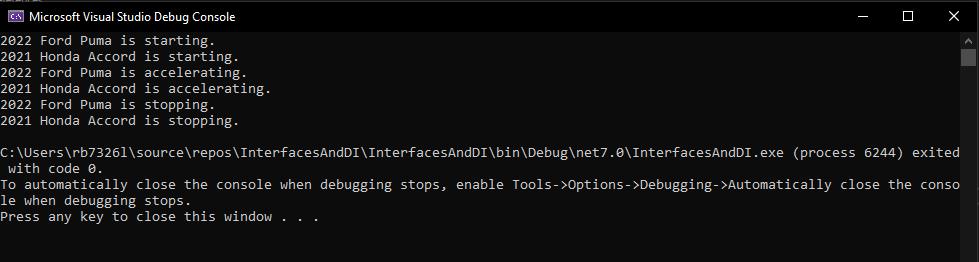
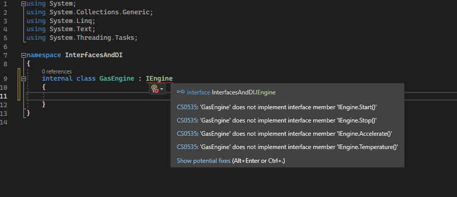
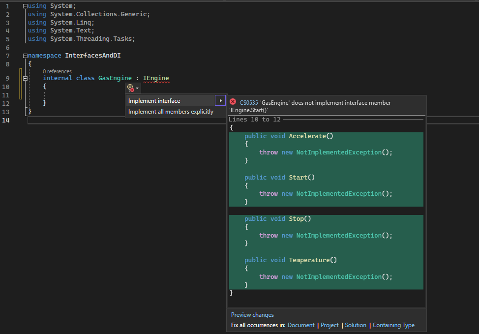
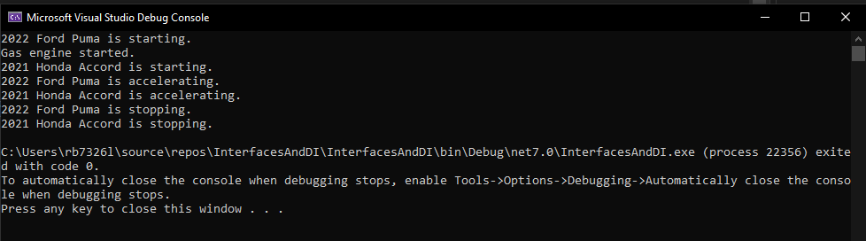

# Lab 15: Interfaces and Dependency Injection

In this lab you are going to build a console application that demonstrates the concepts of Interfaces and Dependency Injection (DI).

## Task 1

1. Create a new C# Console Application make sure you select.... and call it `InterfacesAndDI`

2. Add a new item in the solution and call it `Car.cs`

3. Inside the class create two `public` fields called `Model` and `Year`, each with a `get` and a `private set`:

    ```c#
    // Fields
    public string Model { get; private set; }
    public int Year { get; private set; }
    ```

4. Make an constructor with the following arguments `string model`, `int year`:

    ```c#
    // Constructor
    public Car(string model, int year)
    {
        Model = model;
        Year = year;
    }
    ```

5. Next you need to create three methods, called `Start`, `Accelerate` and `Stop`, inside each method out puit the year and model along with the verb of the funtion.

    ```c#
    // Methods
    public void Start()
    {
        Console.WriteLine($"{Year} {Model} is starting.");
    }

    public void Accelerate()
    {
        Console.WriteLine($"{Year} {Model} is accelerating.");
    }

    public void Stop()
    {
        Console.WriteLine($"{Year} {Model} is stopping.");
    }
    ```

------------------------

## Task 2:

6. Modify `main()` in the `Program.cs` file to create to objects of the `Car` class called, `myCar` and `anotherCar`, remember you need to initialise the object using the expected arguments as per the `Car` constructor.

    ```c#
    // Creating Car instances
    Car myCar = new Car("Ford Puma", 2022);
    Car anotherCar = new Car("Honda Accord", 2021);
    ```

7. For each object call the respective methods; `start`, `accelerate` and `stop`

    ```c#
    // Using Car methods
    myCar.Start();
    anotherCar.Start();

    // Additional method
    myCar.Accelerate();
    anotherCar.Accelerate();

    myCar.Stop();
    anotherCar.Stop();
    ```

8. Run the program and you will see the following output:

    

-------------------------

## Task 3.

Now we are going to use Interfaces and Dependency Injection.

9. Create a new file, and call it `IEngine.cs`, you should see the following code withing the name space:

    ```c#
    internal interface IEngine
    {
    
    }
    ```
    - Replace the `internal` keyword with `public`
    > **Note:**
    >> Naming conventions really do matter, as you can see the VS has templated the code with the keyword interface, because the name of the file has `I`Name.cs

10. Add the following prototype methods, inside the `IEngine` Class.

    ```c#
    void Start();
    void Stop();
    void Accelerate();
    void Temperature();
    ```

11. Go back to the `Car.cs` and add to the class:

    ```c#
    public class Car
    {
        private readonly IEngine _engine;
        ...
    }
    ```

12. Modify the Car constructor to include the `IEngine` class:

    ```c#
    // Constructor with Dependency Injection
    public Car(string model, int year, IEngine engine)
    {
        Model = model;
        Year = year;
        _engine = engine;
    }
    ```

13. Modify the `start`, `accelerate` and `stop` methods to use the respective interface methods:

    ```c#
        // Methods
    public void Start()
    {
        Console.WriteLine($"{Year} {Model} is starting.");
        // Delegating the engine start to the injected engine
        _engine.Start();
    }

    public void Accelerate()
    {
        Console.WriteLine($"{Year} {Model} is accelerating.");
        // Delegating the engine accelerate to the injected engine
        _engine.Accelerate();
    }

    public void Stop()
    {
        Console.WriteLine($"{Year} {Model} is stopping.");
        // Delegating the engine stop to the injected engine
        _engine.Stop();
    }
    ```
 > **Note:**
 >> - `Program.cs` will have some errors relating to the constructors, we will fix this with the next files.

-------------------

 ## Task 4:

In order to use the injected engine interface, we need to use the use inheritance for the interface.

14. Create two new class files called, `ElectricEngine` and `GasEngine`.

15. Inside the `GasEngine.cs` file inherit the `IEngine` class:

    - Notice that you will get errors: 

     

    - Press Alt+Enter and get the proposed fixes.

    

     - Choose implement interface and you should see the following autocomplete:

        ```c#
        ... 
        public void Accelerate()
        {
            throw new NotImplementedException();
        }

        public void Start()
        {
            throw new NotImplementedException();
        }

        public void Stop()
        {
            throw new NotImplementedException();
        }

        public void Temperature()
        {
            throw new NotImplementedException();
        }
        ...
        ```

        >**Note:**
        >> `NotImplementedException` should be replaced with //TODO, unless you want the program to crash.

16. Repeat for the `ElectricEngine` class.

17. Reopen the GasEngine and modify the `Start` method:

    ```c#
    public void Start()
    {
        Console.WriteLine("Gas engine started.");
    }
    ```

18. Go back to `Program.cs` fix the errors in the initialisation of the Car by adding a `new GasEngine` and `new ElectricEngine`.

    ```c#
    Car myCar = new Car("Ford Puma", 2022, new GasEngine());
    Car anotherCar = new Car("Honda Accord", 2021, new ElectricEngine());
    ```

19. Run and see the following output:

    

    Can you see that the Interface `IEngine` has been invoked and the `GasEngine` objects method `Start()` has been invoked for the Ford Puma.

20.  Complete the other Methods for the `ElectricEngine` and `GasEngine` classes.

--------------

## Task 5

Because the `IEngine` can be injected and delegated make a `Boat` class and `start`, `accelerate`, and `stop` the its engine. 


-------------------------


## Source Files

Download project upto end of **Task 4** -> [InterfacesAndDI.zip](.\InterfacesAndDI.zip)