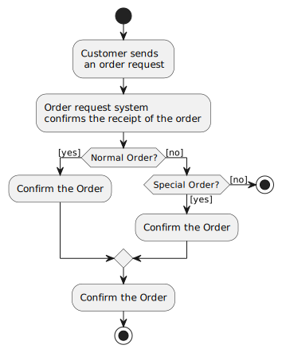

# UML - Activity Diagrams

## Overview:

Activity diagram is another important diagram in UML to describe dynamic aspects of the system.

Activity diagram is basically a flow chart to represent the flow form one activity to another activity.
The activity can be described as an operation of the system.

So the control flow is drawn from one operation to another. This flow can be sequential, branched

or concurrent. Activity diagrams deals with all type of flow control by using different elements like
fork, join etc.

## Purpose:

The basic purposes of activity diagrams are similar to other four diagrams. It captures the dynamic behaviour of the system. Other four diagrams are used to show the message flow from one object to another but activity diagram is used to show message flow from one activity to another.

Activity is a particular operation of the system. Activity diagrams are not only used for visualizing dynamic nature of a system but they are also used to construct the executable system by using forward and reverse engineering techniques. The only missing thing in activity diagram is the message part.

It does not show any message flow from one activity to another. Activity diagram is some time considered as the flow chart. Although the diagrams looks like a flow chart but it is not. It shows different flow like parallel, branched, concurrent and single. 

So the purposes can be described as:

- Draw the activity flow of a system.
- Describe the sequence from one activity to another.
- Describe the parallel, branched and concurrent flow of the system.

## How to draw Use Case Diagram?

Activity diagrams are mainly used as a flow chart consists of activities performed by the system. But activity diagram are not exactly a flow chart as they have some additional capabilities. These additional capabilities include branching, parallel flow, swimlane etc.

Before drawing an activity diagram we must have a clear understanding about the elements used in activity diagram. The main element of an activity diagram is the activity itself. An activity is a function performed by the system. After identifying the activities we need to understand how they are associated with constraints and conditions.

So before drawing an activity diagram we should identify the following elements:

- Activities
- Association
- Conditions
- Constraints

Once the above mentioned parameters are identified we need to make a mental layout of the entire flow. This mental layout is then transformed into an activity diagram.

The following is an example of an activity diagram for order management system. In the diagram four activities are identified which are associated with conditions. One important point should be clearly understood that an activity diagram cannot be exactly matched with the code. The activity diagram is made to understand the flow of activities and mainly used by the business users.

The following diagram is drawn with the four main activities:

- Send order by the customer
- Receipt of the order
- Confirm order
- Dispatch order

After receiving the order request condition checks are performed to check if it is normal or special order. After the type of order is identified dispatch  activity is performed and that is marked as the termination of the process.

[Generated here](https://www.plantuml.com/plantuml/uml/SoWkIImgAStDuG8pkAmyKdDoyXNAyujoKgovh48oCeiLW2WbDIqpBpL58J-FgpYrBBKeCKT1Ioi7A5IifMKDr9fVmEMGcfS2CWS0)

## Where to Use Activity Diagrams?

The basic usage of activity diagram is similar to other four UML diagrams. The specific usage is to model the control flow from one activity to another. This control flow does not include messages.

The activity diagram is suitable for modeling the activity flow of the system. An application can have multiple systems. Activity diagram also captures these systems and describes flow from one system to another. This specific usage is not available in other diagrams. These systems can be database, external queues or any other system.

Now we will look into the practical applications of the activity diagram. From the above discussion it is clear that an activity diagram is drawn from a very high level. So it gives high level view of a system. This high level view is mainly for business users or any other person who is not a technical person.

This diagram is used to model the activities which are nothing but business requirements. So the diagram has more impact on business understanding rather implementation details.

Following are the main usages of activity diagram:

- Modeling work flow by using activities.
- Modeling business requirements.
- High level understanding of the system's functionalities.
- Investigate business requirements at a later stage.