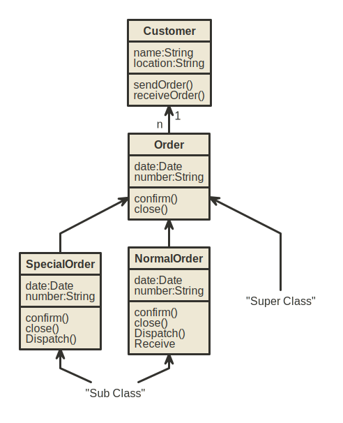

# UML - Class Diagrams

The class diagram is a static diagram. It represents the static view of an application. Class diagram
is not only used for visualizing, describing and documenting different aspects of a system but also
for constructing executable code of the software application.

The class diagram describes the attributes and operations of a class and also the constraints
imposed on the system. The class diagrams are widely used in the modelling of object oriented
systems because they are the only UML diagrams which can be mapped directly with object
oriented languages.

The class diagram shows a collection of classes, interfaces, associations, collaborations and
constraints. It is also known as a structural diagram.

## Purpose:

The purpose of the class diagram is to model the static view of an application. The class diagrams are the only diagrams which can be directly mapped with object oriented languages and thus widely used at the time of construction.

The UML diagrams like activity diagram, sequence diagram can only give the sequence flow of the application but class diagram is a bit different. So it is the most popular UML diagram in the coder community.

So the purpose of the class diagram can be summarized as:

- Analysis and design of the static view of an application.
- Describe responsibilities of a system.
- Base for component and deployment diagrams.
- Forward and reverse engineering.

## How to draw Class Diagram?

Class diagrams are the most popular UML diagrams used for construction of software applications. So it is very important to learn the drawing procedure of class diagram.

Class diagrams have lot of properties to consider while drawing but here the diagram will be considered from a top level view.

Class diagram is basically a graphical representation of the static view of the system and represents different aspects of the application. So a collection of class diagrams represent the whole system.

The following points should be remembered while drawing a class diagram:

 - The name of the class diagram should be meaningful to describe the aspect of the system.

 - Each element and their relationships should be identified in advance.

 - Responsibility attributesandmethods of each class should be clearly identified.

 - For each class minimum number of properties should be specified. Because unnecessary properties will make the diagram complicated.

 - Use notes when ever required to describe some aspect of the diagram. Because at the end of
the drawing it should be understandable to the developer/coder.

 - Finally, before making the final version, the diagram should be drawn on plain paper and
rework as many times as possible to make it correct.

Now the following diagram is an example of an Order System of an application. So it describes a
particular aspect of the entire application.

 - First of all Order and Customer are identified as the two elements of the system and they
have a one to many relationship because a customer can have multiple orders.

 - We would keep Order class is an abstract class and it has two concrete classes inheritance relationship SpecialOrder and NormalOrder.

 - The two inherited classes have all the properties as the Order class. In addition they have additional functions like dispatch and receive .

So the following class diagram has been drawn considering all the points mentioned above:

## Where to use Class Diagrams?
Class diagram is a static diagram and it is used to model static view of a system. The static view describes the vocabulary of the system.

Class diagram is also considered as the foundation for component and deployment diagrams. Class diagrams are not only used to visualize the static view of the system but they are also used to construct the executable code for forward and reverse engineering of any system. 

Generally UML diagrams are not directly mapped with any object oriented programming languages but the class diagram is an exception.

Class diagram clearly shows the mapping with object oriented languages like Java, C++ etc. So from practical experience class diagram is generally used for construction purpose.

So in a brief, class diagrams are used for:

- Describing the static view of the system.
- Showing the collaboration among the elements of the static view.
- Describing the functionalities performed by the system.
- Construction of software applications using object oriented languages.