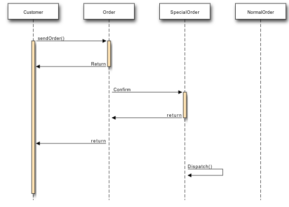

# UML - Interaction Diagrams

## Overview:

From the name Interaction it is clear that the diagram is used to describe some type of interactions
among the different elements in the model. So this interaction is a part of dynamic behaviour of
the system.

This interactive behaviour is represented in UML by two diagrams known as Sequence diagram and Collaboration diagram. The basic purposes of both the diagrams are similar.

Sequence diagram emphasizes on time sequence of messages and collaboration diagram
emphasizes on the structural organization of the objects that send and receive messages.

## Purpose:

The purposes of interaction diagrams are to visualize the interactive behaviour of the system. Now
visualizing interaction is a difficult task. So the solution is to use different types of models to
capture the different aspects of the interaction.

That is why sequence and collaboration diagrams are used to capture dynamic nature but from a
different angle.

So the purposes of interaction diagram can be describes as:

- To capture dynamic behaviour of a system.

- To describe the message flow in the system.

- To describe structural organization of the objects.

- To describe interaction among objects.

## How to draw Interaction Diagram?

As we have already discussed that the purpose of interaction diagrams are to capture the dynamic
aspect of a system. So to capture the dynamic aspect we need to understand what a dynamic
aspect is and how it is visualized. Dynamic aspect can be defined as the snap shot of the running
system at a particular moment.

We have two types of interaction diagrams in UML. One is sequence diagram and the other is a
collaboration diagram. The sequence diagram captures the time sequence of message flow from
one object to another and the collaboration diagram describes the organization of objects in a
system taking part in the message flow.

So the following things are to identified clearly before drawing the interaction diagram:

- Objects taking part in the interaction.
- Message flows among the objects.
- The sequence in which the messages are flowing.
- Object organization.

Following are two interaction diagrams modeling order management system. The first diagram is
a sequence diagram and the second is a collaboration diagram.

The sequence diagram is having four objects Customer, Order, SpecialOrder and NormalOrder.

The following diagram has shown the message sequence for SpecialOrder object and the same can be used in case of NormalOrder object. Now it is important to understand the time sequence of message flows. The message flow is nothing but a method call of an object.

The first call is sendOrder which is a method of Order object. The next call is confirm which is a method of SpecialOrder object and the last call is Dispatch which is a method of SpecialOrder object. So here the diagram is mainly describing the method calls from one object to another and this is also the actual scenario when the system is running.

## Where to use Interaction Diagrams?

We have already discussed that interaction diagrams are used to describe dynamic nature of a system. Now we will look into the practical scenarios where these diagrams are used. To understand the practical application we need to understand the basic nature of sequence and collaboration diagram.

The main purposes of both the diagrams are similar as they are used to capture the dynamic behaviour of a system. But the specific purposes are more important to clarify and understood.

Sequence diagrams are used to capture the order of messages flowing from one object to another. And the collaboration diagrams are used to describe the structural organizations of the objects taking part in the interaction. A single diagram is not sufficient to describe the dynamic aspect of an entire system so a set of diagrams are used to capture is as a whole.

The interaction diagrams are used when we want to understand the message flow and the structural organization. Now message flow means the sequence of control flow from one object to another and structural organization means the visual organization of the elements in a system.

In a brief the following are the usages of interaction diagrams:

- To model flow of control by time sequence.
- To model flow of control by structural organizations.
- For forward engineering.
- For reverse engineering.