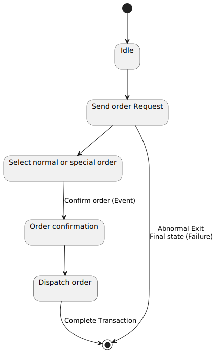

# UML - State Diagrams

## Overview

The name of the diagram itself clarifies the purpose of the diagram and other details. It describes different states of a component in a system. The states are specific to a component/object of a system.

A Statechart diagram describes a state machine. Now to clarify it state machine can be defined as a machine which defines different states of an object and these states are controlled by external or internal events.

Activity diagram explained in next chapter, is a special kind of a Statechart diagram. As Statechart diagram defines states it is used to model lifetime of an object.

## Purpose

Statechart diagram is one of the five UML diagrams used to model dynamic nature of a system. They define different states of an object during its lifetime. And these states are changed by events. So Statechart diagrams are useful to model reactive systems. Reactive systems can be defined as a system that responds to external or internal events. 

Statechart diagram describes the flow of control from one state to another state. States are defined as a condition in which an object exists and it changes when some event is triggered. So the most important purpose of Statechart diagram is to model life time of an object from creation to termination.

Statechart diagrams are also used for forward and reverse engineering of a system. But the main purpose is to model reactive system.

Following are the main purposes of using Statechart diagrams:

- To model dynamic aspect of a system.
- To model life time of a reactive system.
- To describe different states of an object during its life time.
- Define a state machine to model states of an object.

## How to draw Statechart Diagram?

Statechart diagram is used to describe the states of different objects in its life cycle. So the emphasis is given on the state changes upon some internal or external events. These states of objects are important to analyze and implement them accurately.

Statechart diagrams are very important for describing the states. States can be identified as the condition of objects when a particular event occurs. 

Before drawing a Statechart diagram we must have clarified the following points:

- Identify important objects to be analyzed.
- Identify the states.
- Identify the events.

The following is an example of a Statechart diagram where the state of Order object is analyzed.

The first state is an idle state from where the process starts. The next states are arrived for events like send request, confirm request, and dispatch order. These events are responsible for state changes of order object.

During the life cycle of an object hereorderobject it goes through the following states and there may be some abnormal exists also. This abnormal exit may occur due to some problem in the system. When the entire life cycle is complete it is considered as the complete transaction as mentioned below.

The initial and final state of an object is also shown below.

[Generated here](https://www.plantuml.com/plantuml/uml/SoWkIImgAStDuUAArefLqDMrKmWkIIn9DUI2K60He0oCQwLGaf5Ph014YGh59KMPUUbOPFBoIp9IYs3oS9EWHXj118pWHdCvfEQbW9m00000)

## Where to use Statechart Diagrams?

From the above discussion we can define the practical applications of a Statechart diagram. Statechart diagrams are used to model dynamic aspect of a system like other four diagrams disused in this tutorial. But it has some distinguishing characteristics for modeling dynamic nature.

Statechart diagram defines the states of a component and these state changes are dynamic in nature. So its specific purpose is to define state changes triggered by events. Events are internal or external factors influencing the system.

Statechart diagrams are used to model states and also events operating on the system. When implementing a system it is very important to clarify different states of an object during its life time and statechart diagrams are used for this purpose. When these states and events are identified they are used to model it and these models are used during implementation of the system.

If we look into the practical implementation of Statechart diagram then it is mainly used to analyze the object states influenced by events. This analysis is  helpful to understand the system behaviour during its execution.

So the main usages can be described as:

- To model object states of a system.
- To model reactive system. Reactive system consists of reactive objects.
- To identify events responsible for state changes.
- Forward and reverse engineering.